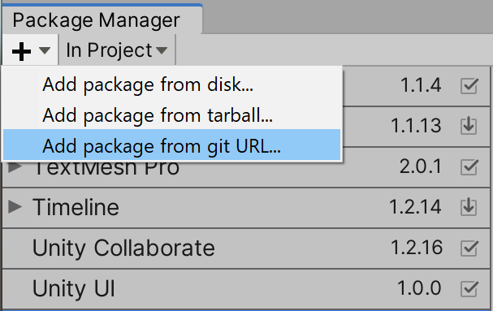

<h1 align="center">🖼️📷 Unity-Native-Sharing 📷🖼️</h1>

Unity-Native-Sharing is a plugin to open native sharing dialogs on iOS and Android.

<h3 align="center">📱 Social 📱</h3>

 

<h3 align="center">👊 Support 👊</h3>

All of these projects are made during my free time, with more being added over time. If you'd like to support me, you can do it either by [sponsoring me on GitHub](https://github.com/users/NicholasSheehan/sponsorship) or by donating via PayPal

[](https://www.paypal.me/NicholasSheehan)

<h3 align="center">📝 Changelog 📝</h3>

[What's New? Check the CHANGELOG](CHANGELOG.md)

Watch this repository to be notified of new releases! 

<h3 align="center">🤝 Contribution 🤝</h3>

For contributing please read [CONTRIBUTING.md](CONTRIBUTING.md)

Don't worry about getting it 100% right, I can tidy it up as I review

<h3 align="center">🖥️ System Requirements 🖥️</h3>

Unity 2018.3.14f1 or later. Older versions may work, feel free to test!

<h3 align="center">🤔 Examples 🤔</h3>

Examples can be found at [Unity-Native-Example-Project](https://github.com/NicholasSheehan/Unity-Native-Example-Project)

<h1 align="center">🛠️ Installation 🛠️</h1>

<h2 align="center">Unity 2019.3 or later (Using Unity Package Manager)</h2>



`https://github.com/NicholasSheehan/Unity-Native-Sharing.git#v1.0.5`

<h2 align="center">Unity 2018.3 or later (Using Unity Package Manager)</h2>

Add this to the projects `manifest.json`

```
"com.unitynative.sharing" : "https://github.com/NicholasSheehan/Unity-Native-Sharing.git"
```

To update the package, change suffix `#{version}` to the target version.

* e.g. `"com.unitynative.sharing" : "https://github.com/NicholasSheehan/Unity-Native-Sharing.git#v1.0.5"`

<h2 align="center">Unity 2018.3 or later (Using OpenUPM)</h2>

[](https://openupm.com/packages/com.unitynative.sharing/)

This package is available on [OpenUPM](https://openupm.com)

You can install it via [openupm-cli](https://github.com/openupm/openupm-cli)

```
openupm add com.unitynative.sharing
```

<h2 align="center">Unity 2018.2</h2>

`Unity 2018.2` supports embedded packages.

1. Download a source code zip file from the [Releases](https://github.com/NicholasSheehan/Unity-Native-Sharing/releases) page
2. Extract it
3. Import it under the `Packages` directory in your Unity project

<h1 align="center">👍 Features 👍</h1>

- Share text to an app
- Share screenshots with text to an app

<h2 align="center">🧪 Testing 🧪</h2>

--            | `Android 8.0.0` | `iOS 10.3.3` | `iOS 11.3.1`
------------- | --------------  | -------------| ------------
Facebook      | No Text         | No Text      | No Text
Messenger     | No Text         | No Text      | No Text
Instagram     | No Text         | No Text      | No Text
Twitter       | ✔              | ✔            | ✔
Discord       | ✔              | ✔            | ✔
Slack         | ✔              | ✔            | ✔

<h3 align="center">😭 Known Issues 😭</h3>

[Facebook, Messenger and Instagram cannot share text at all, unless passed into their SDK](https://answers.unity.com/questions/871846/can-i-post-to-facebook-with-my-own-text.html)

<h2 align="center">📱 Platform Notes 📱</h2>

<h3 align="center">🤖 Android 🤖</h3>

The Android plugin requires `androidx.appcompat:appcompat:1.1.0` to run.

This plugin has support for [Play Services Resolver for Unity](https://github.com/googlesamples/unity-jar-resolver) which will take care of this for you
